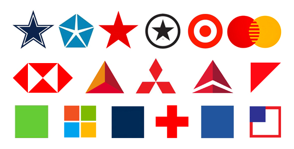

# OLYMPIC RINGS LAB

Let's make some Olympic Rings using `p5.js`!

## LAB
**PART 1: Black and White**

Today's labs starts with recreating this black and white image.

Using the p5.js commands of `.ellipse`, `.fill`, `.noFill`, and/or `.strokeWeight` to create an image of Olympic Rings in black and white. Stuck? Make sure to refer to the [p5 documentation](https://p5js.org/reference/)!

**PART 2: Adding Color**

Now that we have made our rings, it is time to add color!

Using the command `stroke` and named colors *or* RGB/hexidecimal value, color the rings to match the colors above. Use the [p5 reference to help](https://p5js.org/reference/#/p5/stroke)!

**PART 3 - STRETCH: MAKE A LOGO**

Using the commands you have learned and other shapes that exist in p5, create one or more of the logos shown above. Create as many as you can! You can find [documentation on other shapes here](https://p5js.org/reference/#group-Shape). **HINT:** Explore the triangle and vertex documentation for these shapes!